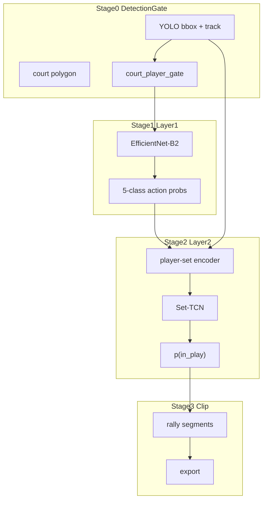

# 层级 ML 回合切分管线

> 本文档描述 **YOLO → EfficientNet-B2 → Set-TCN** 层级 ML 管线的架构、进展与用法。
> 产品级 CLI 路线图见 [`ROADMAP.md`](./ROADMAP.md)；模块职责见 [`ARCHITECTURE.md`](./ARCHITECTURE.md)。

---

## 背景

业余固定机位网球视频切分需要两层语义：

| 层级 | 任务 | 标签示例 |
|------|------|----------|
| **Layer 1** | 球员瞬时动作 | serving / hitting / moving / pick_ball / rest |
| **Layer 2** | 回合是否进行中 | in_play / dead_time |

早期曾尝试 VLM（Qwen3-VL）直接判动作，macro-F1 ≈ **0.13**，已移除。当前 Layer1 使用自训 **EfficientNet-B2**（真实 test macro-F1 **0.396**）。Layer2 使用 **Set-TCN** 对 scene 序列输出 `p(in_play)`，再解码为剪辑片段。

标注规模：**3360 条** per-player per-frame（train 2150 / val 330 / test 880）。

---

## 管线总览

```text
原始视频
  ├─→ YOLO 球员检测 + IOU 跟踪
  ├─→ court_player_gate（过滤非场上检测）
  └─→ EfficientNet-B2（expanded crop 256×256 → 5 类 softmax）
           ↓
  scene_frames 聚合（按 frame_index 多球员 → 单帧特征）
           ↓
  Set-TCN（Tiny TCN → p(in_play) per timestamp）
           ↓
  rally_decoder（阈值 + 平滑 + buffer → rally segments）
           ↓
  timeline.json → FFmpeg export
```



**默认模型**（本地 `datasets/eval/`，不入 git）：

| 组件 | 路径 |
|------|------|
| Layer1 CNN | `efficientnet_b2_expanded_action_classifier.pt` |
| Layer2 Set-TCN | `rally_set_tcn_cnn.pt`（threshold=0.5） |
| Stage0 gate | `court_player_gate.pkl` |

---

## 实施阶段与状态

| 阶段 | 内容 | 状态 |
|------|------|------|
| **1** | `detection_validity` + `scene_frames` 数据集 | ✅ |
| **2** | `court_player_gate` 训练（precision≈0.99） | ✅ |
| **3** | EfficientNet-B2 Layer1 训练与 benchmark | ✅ |
| **4.1** | Oracle Layer1 → LightGBM / Set-TCN / BiGRU baseline | ✅ |
| **4.2** | CNN-OOF 概率缓存 + Set-TCN 重训 | ✅ |
| **5** | 剪辑级片段评估 vs benchmark | ✅ |
| **6** | CLI 集成（`--use-ml-decoder` / `segment-ml`） | ✅ |

### 关键指标

**Layer1（EfficientNet-B2，真实 test 681）**

| 指标 | 数值 |
|------|------|
| macro-F1 | 0.396 |
| stratified 200 | 0.812 |

**Layer2 帧级（test 790 帧）**

| 输入 | F1 |
|------|-----|
| oracle Layer1 + Set-TCN | 0.776 |
| **CNN-OOF probs + Set-TCN** | **0.826** |

**剪辑级（7252 benchmark，6 回合）**

| 方法 | recall | mean IoU |
|------|--------|----------|
| oracle Set-TCN | 0.50 | 0.61 |
| **CNN-OOF Set-TCN** | **0.50** | **0.78** |

---

## CLI 用法

```bash
# 一键 ML 分段 + 导出（推荐）
tenniscut process my_session --use-ml-decoder

# 仅写 work/timeline.json
tenniscut segment-ml my_session

# 自定义 checkpoint
tenniscut process my_session --use-ml-decoder \
  --ml-action-model datasets/eval/efficientnet_b2_expanded_action_classifier.pt \
  --ml-set-tcn-model datasets/eval/rally_set_tcn_cnn.pt
```

不加 `--use-ml-decoder` 时仍走启发式路径（MediaPipe 挥拍 + rally_lifecycle），见 [`ARCHITECTURE.md`](./ARCHITECTURE.md)。

在线实现：[`tenniscut/ml/runtime_rally.py`](../tenniscut/ml/runtime_rally.py)

---

## 训练与离线评估

详见 [`datasets/README.md`](../datasets/README.md) 与 [`scripts/ml/LABEL_SPRINT.md`](../scripts/ml/LABEL_SPRINT.md)。

常用命令：

```bash
# Layer1 训练
python scripts/ml/train_action_classifier.py \
  --train-manifest datasets/player_actions/manifests/train_labeled.jsonl \
  --val-manifest datasets/player_actions/manifests/val_labeled.jsonl \
  --output datasets/eval/efficientnet_b2_expanded_action_classifier.pt

# CNN 概率缓存 → Layer2 重训
python scripts/ml/cache_cnn_predictions.py \
  --output-dir datasets/player_actions/cnn_predictions
python scripts/ml/train_rally_set_tcn.py \
  --action-probs-dir datasets/player_actions/cnn_predictions \
  --output datasets/eval/rally_set_tcn_cnn.pt

# 剪辑级评估
python scripts/ml/eval_rally_segments.py \
  --model datasets/eval/rally_set_tcn_cnn.pt \
  --action-probs-dir datasets/player_actions/cnn_predictions
```

---

## 关键文件

| 文件 | 用途 |
|------|------|
| `tenniscut/ml/runtime_rally.py` | 在线 ML 管线 |
| `tenniscut/ml/rally_decoder.py` | 概率 → 片段解码 |
| `tenniscut/ml/set_tcn.py` | Set-TCN 模型 |
| `tenniscut/ml/scene_frames.py` | manifest → scene 聚合 |
| `tenniscut/ml/court_player_gate.py` | Stage0 过滤 |
| `scripts/ml/train_action_classifier.py` | Layer1 训练 |
| `scripts/ml/cache_cnn_predictions.py` | CNN-OOF 缓存 |
| `scripts/ml/train_rally_set_tcn.py` | Layer2 训练 |
| `scripts/ml/eval_rally_segments.py` | 剪辑级指标 |

---

## 已知瓶颈与后续

| 问题 | 说明 |
|------|------|
| Layer1 泛化 | rest vs moving 混淆；test F1 0.40 vs oracle Layer2 上限 0.96 |
| 稀疏采样 | scene_frames 稀疏 export 限制片段 recall；dense 4Hz 会更准 |
| session 分布 | 7252 偏 in_play；需 7559 + train dead_time 联合评估 |
| 消融实验 | YOLO-only / CNN-only / +track 特征（Phase 4.3，待做） |
| 球检测微调 | YOLO ball 标注 + 微调（Phase 4.4，待做） |

已放弃：**VLM Layer1**、ResNet 系列（统一为 EfficientNet-B2）。
